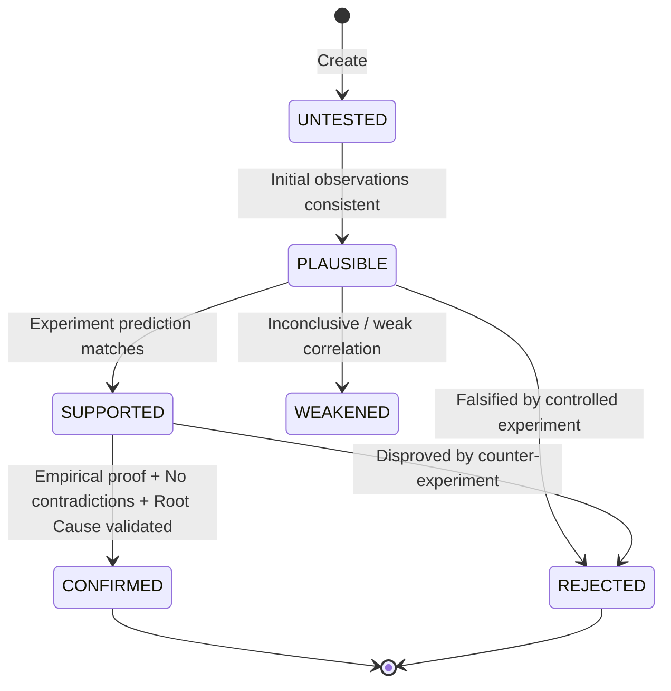

# Forensic Investigation Protocol (ASI-12)

The ASI-12 Protocol is a 12-stage forensic standard designed for autonomous agents and developers to systematically isolate root causes.

---

## Stage Overview

| Stage | Name | Key Objective | Output Artifact |
|---|---|---|---|
| **1** | Project Intake | Formalize case statement & category | `case.json` |
| **2** | Environment Discovery | Record OS, architecture, runtime versions | `E-001` (runtime_environment) |
| **3** | Problem Reproduction | Establish baseline failure probability | `E-002` (reproduction_metric) |
| **4** | Hypothesis Generation | Formulate falsifiable candidate hypotheses | `hypotheses.json` (`H1`, `H2`...) |
| **5** | Experiment Planning | Rank experiments by Information Gain First | Candidate experiment queue |
| **6** | Controlled Experiments | Execute commands in sandbox isolation | `experiments.jsonl` (`EXP-xxx`) |
| **7** | Evidence Analysis | Tag claims: Observed / Inferred / Verified | `evidence.jsonl` |
| **8** | Hypothesis Elimination | Falsify competing explanations with evidence | `[REJECTED]` status in `hypotheses.json` |
| **9** | Root Cause Identification | What, Why, Where, and How Confirmed | `[CONFIRMED]` status in `hypotheses.json` |
| **10** | Minimal Fix & Diff Reasoning | Apply surgical patch with diff blast analysis | Code patch & `code_diff` evidence |
| **11** | Independent Verification | Rerun repro (e.g. 100 runs for flaky bugs) + Regressions | Verification metric & Confidence assessment |
| **12** | Forensic Report Generation | Compile structured audit report | `report.md` & `case.json` closed |

---

## State Transition Rules for Hypotheses

### Guardrail Violations
1. **Unsubstantiated Confirmation Violation:** Attempting to transition to `CONFIRMED` without verified supporting evidence.
2. **Contradiction Overlook Violation:** Attempting to transition to `CONFIRMED` while active contradicting evidence exists.
3. **Arbitrary Elimination Violation:** Attempting to transition to `REJECTED` without an empirical experiment or evidence record.

---

## Termination Taxonomy

An investigation must terminate with one of four verdicts:

- **`SUCCESS`**: Definitively identified root cause, minimal fix applied, 100% verified without regressions.
- **`PARTIAL`**: Root cause confirmed with high confidence, but fix or end-to-end verification cannot be applied (e.g. closed-box binary).
- **`BLOCKED`**: Missing execution environment, unexecutable reproduction harness, or denied permissions.
- **`UNKNOWN`**: Exhaustive experiments failed to reproduce or isolate failure. Honest stoppage without fabrication.
